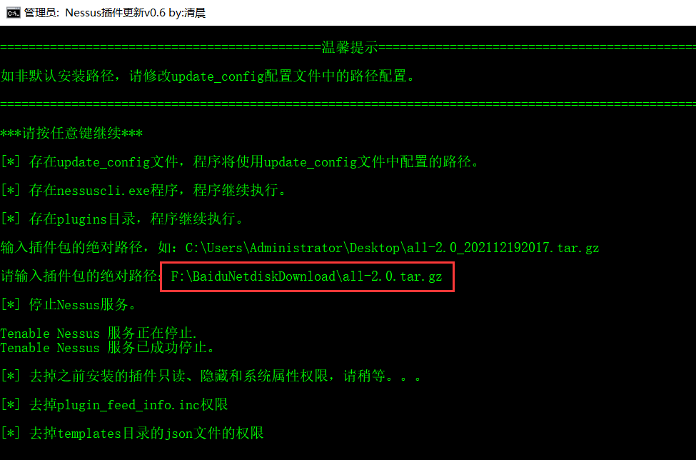
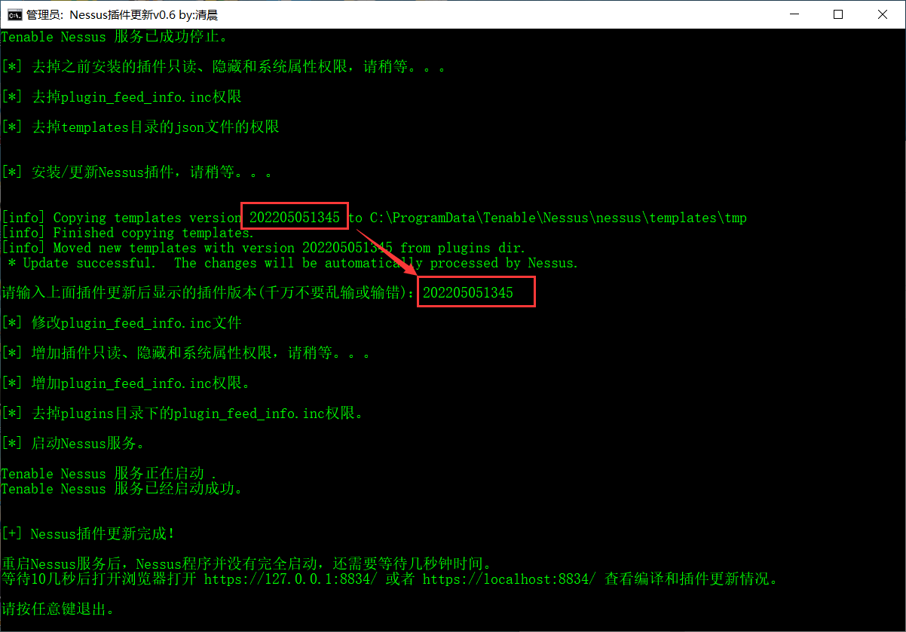
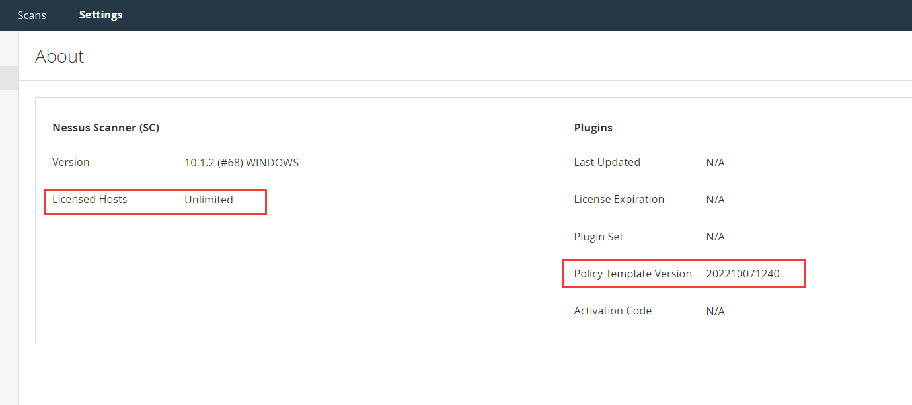
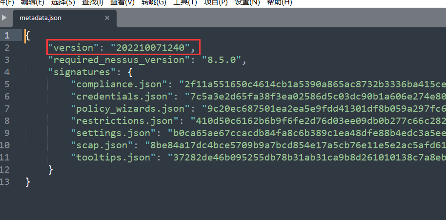
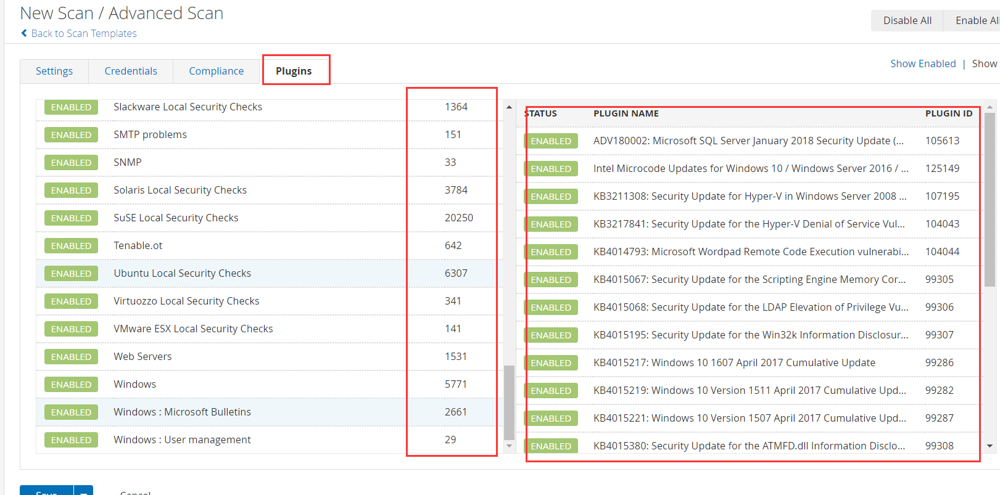

# 工具介绍

这个是Nessus破解插件更新脚本，但是：

__非默认安装位置，需要配置update_config配置文件里的路径！__

# 工具的使用

破解插件包你可以在这个链接下载：（Nessus20230418插件）https://pan.quark.cn/s/9849135cd3ac ，解压密码：mht（来着棉花糖网络安全圈公众号）

Nessus安装参考这里：https://www.ddosi.org/nessus/

工具的使用就是修改update_config的路径，然后运行"Nessus破解插件更新.bat"程序。

然后按照提示输入破解插件包路径，插件包是.tar.gz的文件。

再按照提示，把更新后的版本号复制粘贴输入上去回车。然后静静的等着就好了。

然后浏览器访问https://127.0.0.1:8834/ 或者 https://localhost:8834/ 登录Nessus，查看插件的版本是不是更新的版本，使用数量是不是无限制。

这里插一嘴。这个版本貌似和templates目录下的json文件有关系，和plugin_feed_info.inc文件好像没多大关系。

再新建任务看看插件是否真的在，在就说明更新成功了。

