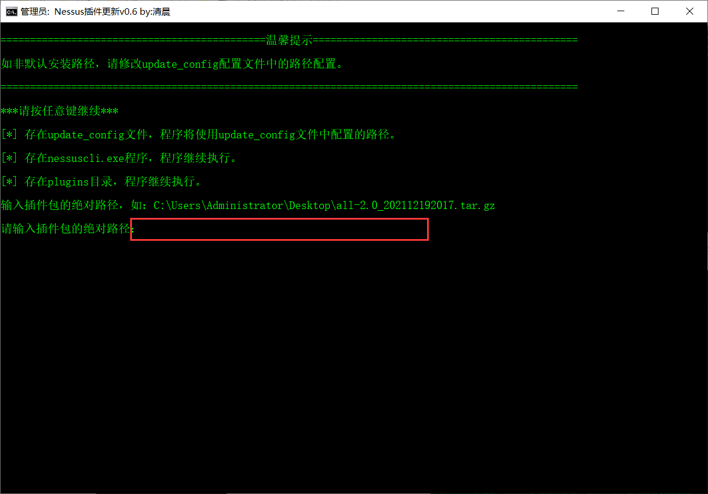
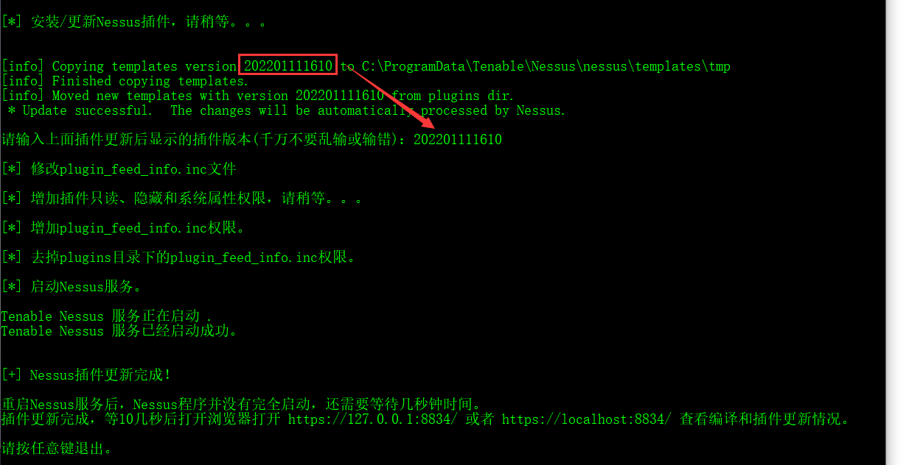

# 工具介绍

这个是Nessus破解插件更新脚本，但是：

__非默认安装位置，需要配置update_config配置文件里的路径！__

# 工具的使用

破解插件包你可以在这个链接下载：https://www.ddosi.org/nessus-plugin-pro-3/

Nessus安装参考这里：https://www.ddosi.org/nessus/

工具的使用就是修改update_config的路径，然后运行"Nessus破解插件更新.bat"程序。

然后按照提示输入破解插件包路径，插件包是.tar.gz的文件。

再按照提示，把更新后的版本号复制粘贴输入上去回车。然后静静的等着就好了。

