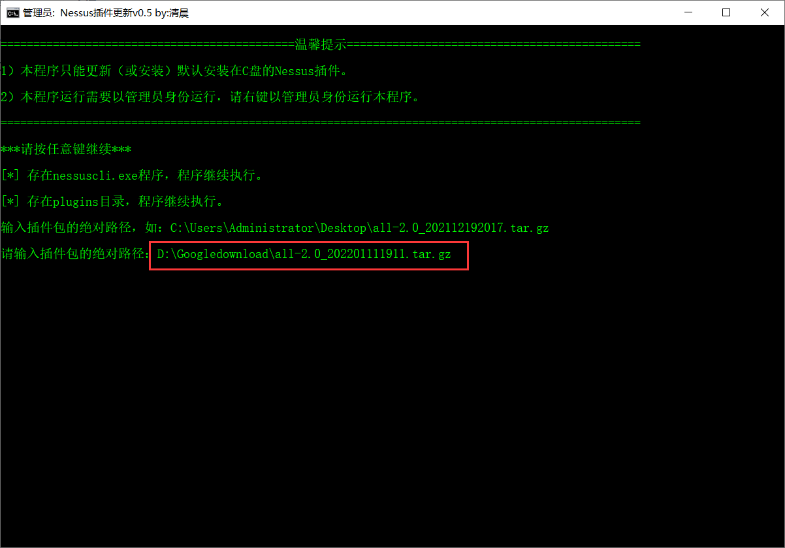

# 工具介绍

这个是Nessus破解插件更新脚本，但是：

1. 本程序只能更新（或安装）默认安装在C盘的Nessus插件。
2. 本程序运行需要以管理员身份运行，请右键以管理员身份运行本程序。

嘛。毕竟我的水平过菜，如果不是默认安装在C盘我不知道你的路径在哪，不知道怎么改。

如果你都知道你安装的路径在哪还有插件位置在哪，那你都用不到我这个东西。

本来把我每次更新插件都要输入那几条命令，感觉可以写个脚本，然后就写了，恰好我有个同事不会更新Nessus的插件，而且默认按照在C盘的。我就发给他用用了。还可以。

# 工具的使用

破解插件包你可以在这个链接下载：https://www.ddosi.org/?s=Nessus

Nessus安装参考这里：https://www.ddosi.org/nessus/

工具的使用就是直接右键以管理员方式运行。

然后按照提示输入你下载的破解插件包，插件包是.tar.gz的文件。

再按照提示，把更新后的版本号复制粘贴输入上去回车。然后静静的等着就好了。

